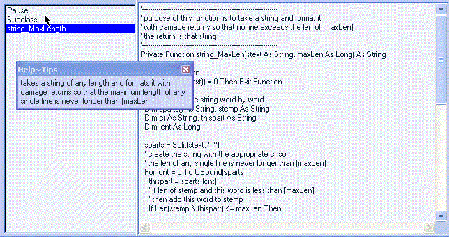



## InfoTips\~Help\.\.\.a different, but, simple, way to show help tips to your user

### Description

This project is actually part of a larger project...but the idea of this submission is just a different and effective way to offer user with help tips. The good thing about this way is the user can turn it on or off at will so its never in his way unless he wants it that way. To access the info tips in this project simply left click on the large textbox to the right (text1) which brings up a small menu..select "show help tips"
 
### More Info
 

             |
---                |---
**Submitted On**   |2005-03-14 00:20:00
**By**             |[Evan Toder](https://github.com/Planet-Source-Code/PSCIndex/blob/master/ByAuthor/evan-toder.md)
**Level**          |Intermediate
**User Rating**    |5.0 (10 globes from 2 users)
**Compatibility**  |VB 4\.0 \(32\-bit\), VB 5\.0, VB 6\.0
**Category**       |[Coding Standards](https://github.com/Planet-Source-Code/PSCIndex/blob/master/ByCategory/coding-standards__1-43.md)
**World**          |[Visual Basic](https://github.com/Planet-Source-Code/PSCIndex/blob/master/ByWorld/visual-basic.md)
**Archive File**   |[InfoTips\~H1864213142005\.zip](https://github.com/Planet-Source-Code/evan-toder-infotips-help-a-different-but-simple-way-to-show-help-tips-to-your-user__1-59465/archive/master.zip)

